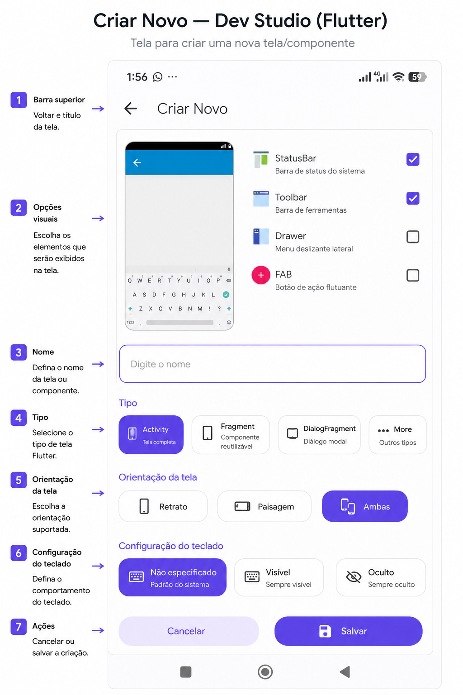
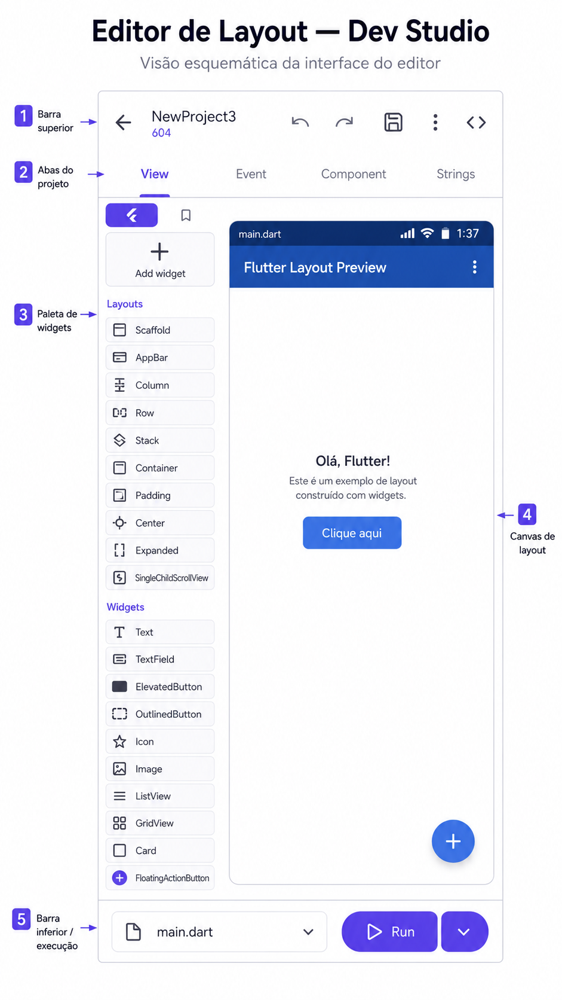
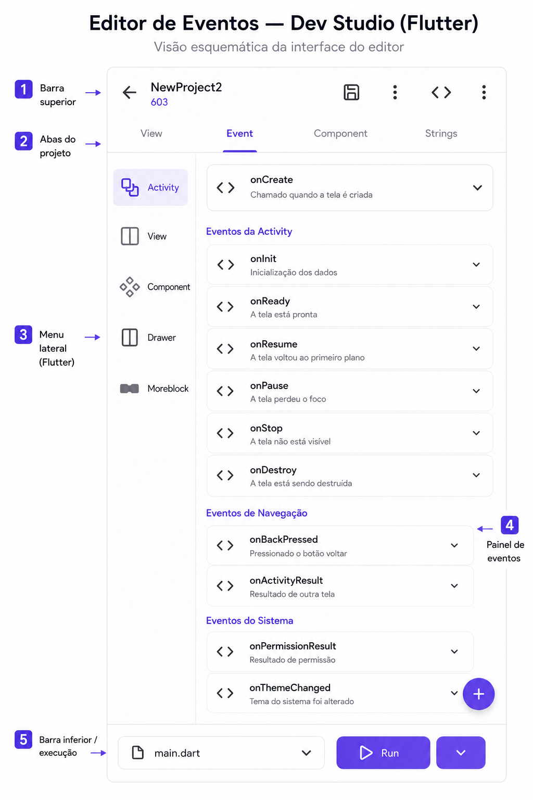

# Dev Studio

[](https://github.com/FabioSilva11/dev-studio/actions/workflows/release-apk.yml)

Dev Studio e um ambiente de desenvolvimento mobile inspirado no Sketchware, criado com Flutter, focado em criar, abrir e editar projetos Android de forma visual.

## Baixar APK

Toda versao enviada para a branch `main` dispara o GitHub Actions para compilar o APK Android e publicar um arquivo em [Releases](https://github.com/FabioSilva11/dev-studio/releases).

O APK publicado segue o formato `Dev-Studio-<versao>-arm64.apk`.

## Visao Geral

O projeto oferece uma interface moderna para gerenciamento de projetos, criacao de novos apps, configuracao visual de componentes e edicao estrutural de telas. A proposta e aproximar a experiencia de um construtor visual mobile com recursos conhecidos por usuarios do ecossistema Sketchware.

## Interface

### Criar Novo



### Editor De Layout



### Editor De Eventos



## Recursos

- Listagem de projetos com busca, ordenacao e fixacao de favoritos.
- Leitura de projetos locais do Sketchware com acesso ao armazenamento do dispositivo.
- Criacao de novos projetos com nome do app, pacote, icone, tema e versao.
- Editor visual de telas com canvas, arrastar e soltar e edicao de propriedades.
- Gerenciamento de eventos, componentes e strings do projeto.
- Paletas de tema prontas e geracao aleatoria de cores.
- Area com atalhos para APIs e recursos web uteis no desenvolvimento.

## Tecnologias

- Flutter
- Dart
- Material 3
- MethodChannel para integracao com recursos nativos Android

## Estrutura Do Projeto

```text
lib/
  main.dart
  main_screen.dart
  project_creation_screen.dart
  project_editor_screen.dart
  models/
  services/
android/
assets/
test/
```

## Como Executar

### Requisitos

- Flutter SDK instalado
- Dart SDK compativel com o Flutter utilizado
- Android Studio ou SDK Android configurado
- Dispositivo Android ou emulador

### Passos

```bash
flutter pub get
flutter run
```

## Build Android

Para gerar uma APK de release:

```bash
flutter build apk --release --target-platform android-arm64
```

Para gerar uma APK de debug:

```bash
flutter build apk --debug
```

## Fluxo Principal

1. Abrir o app e carregar os projetos disponiveis.
2. Autorizar acesso ao armazenamento quando necessario.
3. Criar um novo projeto ou abrir um projeto existente.
4. Editar layout, widgets, eventos, componentes e strings.
5. Salvar as alteracoes do projeto.

## Estado Atual

O projeto ja possui base funcional para:

- gerenciamento de projetos
- criacao de apps
- editor visual
- configuracao de recursos principais

Algumas acoes da interface ainda aparecem como futuras integracoes, principalmente em menus secundarios e ferramentas avancadas.

## Testes

Para executar os testes:

```bash
flutter test
```

## Objetivo

O Dev Studio busca oferecer uma experiencia pratica de construcao visual de apps Android em uma interface atualizada, com foco em produtividade, organizacao e compatibilidade com fluxos inspirados no Sketchware.
